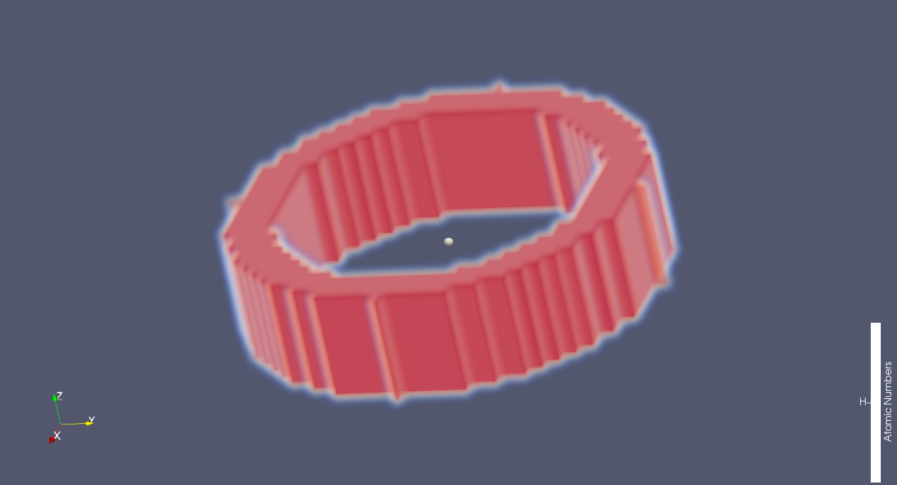

# FDTD_make_shape

[SALMON](https://salmon-tddft.jp/) has a FDTD functionality to solve electromagnetic problems. This program, `FDTD_make_shape`, is a tool to make shapes for the FDTD calculation in the format of the input file of SALMON.test

## Requirements

 - Python 3
 - NumPy

If you are windows user who uses python for the first time, I recommend to install [WinPython](https://sourceforge.net/projects/winpython/) that includes all requirements for this program.

## Usage

`make_shape.py` is an executable file. `shape.inp` is an input file. `make_shape.py` and `shape.inp` **must be in the same directory**. When you use WinPython, open `make_shape.py` by Spyder.exe that is included in WinPython, and push F5 key.  
The input parameters are as follows: 

- ***al_em(3)***  
Size of simulation box in electromagnetic analysis. **This must match the input keyword in SALMON**.

- ***dl_em(3)***  
Spacing of real-space grids in electromagnetic analysis. **This must match the input keyword in SALMON**.

- ***yn_periodic***  
Periodic boundary condition. `'n'` is for isolated systems, and `'y'` is for periodic systems. **Note that the coordinate system ranges from `-al_em/2` to `al_em/2` for `yn_periodic='n'` while ranges from `0` to `al_em` for `yn_periodic='y'`**. Default is `'n'`.

- ***output***  
Type of output file. `'cube'` and `'mp'` can be chosen. If `'cube'`, the output file can be drawn by [ParaView](https://www.paraview.org/download/)(Usage: Open the cube file by ParaView→click:Molecule→Apply→Gridded Data→Representation→Volume) in which `al_em` is used in atomic units. However, at this time(2018/11/27), ParaView cannot well draw for cuboid mesh(cubic mesh is no problem). Default is `'cube'`.

- ***n_s***  
Number of shape-templates. Maximum is 200.

- ***yn_copy_x, yn_copy_y, yn_copy_z***  
When a part of shape-template penetrates to the outer side of the unit-cell, copy of the penetrating part is automatically generated into the unit cell for each axis. `yn_copy_x='y'`, `yn_copy_y='y'`, `yn_copy_z='y'` are executed for x, y, z axes, respectively(See example 10). Default is `'n'`.

- ***rot_type***  
Type of rotation for shape-template. `'radian'` and `'degree'` can be chosen. Default is `'radian'`.

- ***typ_s(x)***  
Type of x-th shape-template. Maximum of x is `n_s`. `'ellipsoid'`, `'half-ellipsoid'`, `'elliptic-cylinder'`, `'triangular-cylinder'`, `'rectangular-cylinder'`, `'elliptic-cone'`, `'triangular-cone'`, `'rectangular-cone'`, and `'elliptic-ring'` can be chosen.

- ***id_s(x)***  
ID number of x-th shape-template. **This ID number must match the index of the input parameter in SALMON**(e.g. `epsilon_em`, `mu_em`, and `sigma_em`).

- ***inf_s(x,:)***  
Information of x-th shape-template. This depends on `typ_s`. See `shape-template_manual.pdf` in detail.

- ***ori_s(x,3)***  
Origin of x-th shape-template. Default is `0.0d0, 0.0d0, 0.0d0`.

- ***rot_s(x,3)***  
Rotation angle of x-th shape-template. Rotation axes of `rot_s(x,1:3)` correspond to x-, y-, and z-axes, respectively. Priorities for rotation axes are x-, y-, and z-axes. Default is `0.0d0, 0.0d0, 0.0d0`.

## External Links

### SALMON Project
  - SALMON Official Website - https://salmon-tddft.jp/
  - SALMON Github Repository - https://github.com/SALMON-TDDFT
